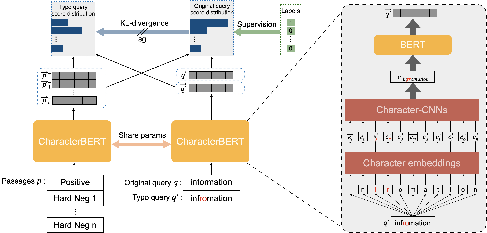

# CharacterBERT-DR



The offcial repository for [CharacterBERT and Self-Teaching for Improving the Robustness of Dense Retrievers on Queries with Typos](https://arxiv.org/pdf/2204.00716.pdf), Shengyao Zhuang and Guido Zuccon, SIGIR2022


## Installation
Our code is developed based on [Tevatron](https://github.com/texttron/tevatron) DR training toolkit (v0.0.1).

First clone this repository: `git clone https://github.com/ielab/CharacterBERT-DR.git`

Then install with pip: `pip install --editable .`

> Note: The current code base has been tested with, `torch==1.8.1`, `faiss-cpu==1.7.1`, `transformers==4.9.2`, `datasets==1.11.0`, `textattack=0.3.4`

## Preparing data and model

### Typo queries and dataset
All the queries and qrels used in our paper are in the `/data` folder.

### Download CharacterBERT
Download [CharacterBERT](https://github.com/helboukkouri/character-bert/tree/0c1f5c2622950988833a9d95e29bc26864298592#pre-trained-models) trained with general domain with this [link](https://docs.google.com/uc?id=11-kSfIwSWrPno6A4VuNFWuQVYD8Bg_aZ).

## Train

### CharacterBERT-DR + ST training
```
python -m tevatron.driver.train \
--model_name_or_path bert-base-uncased \
--character_bert_path ./general_character_bert \
--output_dir model_msmarco_characterbert_st \
--passage_field_separator [SEP] \
--save_steps 40000 \
--dataset_name Tevatron/msmarco-passage \
--fp16 \
--per_device_train_batch_size 16 \
--learning_rate 5e-6 \
--max_steps 150000 \
--dataloader_num_workers 10 \
--cache_dir ./cache \
--logging_steps 150 \
--character_query_encoder True \
--self_teaching True
```
If you want to do typo augmentation training introduced in our previous [paper](https://arxiv.org/pdf/2108.12139.pdf), replace `--self_teaching True` with `--typo_augmentation True`.

If you want to train a standard BERT DR intead of CharacterBERT DR, remove `--character_bert_path` and `--character_query_encoder` arguments.

If you do not want to train the model, we provide our trained model checkpoints for you to download:

| Model Checkpoints                                                                                            | 
|--------------------------------------------------------------------------------------------------------------|
| [StandardBERT-DR](https://drive.google.com/file/d/1dhv1429rZpLofH5ksPp9o_VYVBj5RAjE/view?usp=sharing)        |
| [StandardBERT-DR + Aug](https://drive.google.com/file/d/1ctW2X5FaDFyp2slqzxi2oI9BSy2VQwiJ/view?usp=sharing)  |
| [StandardBERT-DR + ST](https://drive.google.com/file/d/1HQ0HMxj9y5-ouLxMACHgsQs-7vc1G_t3/view?usp=sharing)   |
| [CharacterBERT-DR](https://drive.google.com/file/d/1UaltmRpSxmeB8lJx51MCvJIpYcDlp-XG/view?usp=sharing)       |
| [CharacterBERT-DR + Aug](https://drive.google.com/file/d/1tG6seQ_ZpO9Q8U72VL6ig68s1W5D-TaF/view?usp=sharing) |
| [CharacterBERT-DR + ST](https://drive.google.com/file/d/1CJLJbPEWhwq8WtVG-rxmtlWg6IG5Esai/view?usp=sharing)  |

## Inference

In this example, we will do inference with our newly created DL-typo dataset, if you want to do inference with other datasets such as MS MARCO, change the query file to others in the `/data` folder.

### Encode queries and corpus
After you have the trained model, you can run the following command to encode queries and corpus into dense vectors:

```
mkdir msmarco_charcterbert_st_embs
# encode query
python -m tevatron.driver.encode \
  --output_dir=temp \
  --model_name_or_path model_msmarco_characterbert_st/checkpoint-final \
  --fp16 \
  --per_device_eval_batch_size 128 \
  --encode_in_path data/dl-typo/query.typo.tsv \
  --encoded_save_path msmarco_charcterbert_st_embs/query_dltypo_typo_emb.pkl \
  --q_max_len 32 \
  --encode_is_qry \
  --character_query_encoder True


# encode corpus
for s in $(seq -f "%02g" 0 19)
do
python -m tevatron.driver.encode \
  --output_dir=temp \
  --model_name_or_path model_msmarco_characterbert_st/checkpoint-final \
  --fp16 \
  --per_device_eval_batch_size 128 \
  --p_max_len 128 \
  --dataset_name Tevatron/msmarco-passage-corpus \
  --encoded_save_path msmarco_charcterbert_st_embs/corpus_emb.${s}.pkl \
  --encode_num_shard 20 \
  --encode_shard_index ${s} \
  --cache_dir cache \
  --character_query_encoder True \
  --passage_field_separator [SEP]
done
```
If you are using our provided model checkpoints, change `--model_name_or_path` to the downloaded model path.
If you running inference with standard BERT, remove `--character_query_encoder True` argument.

### Retrieval
Run the following commands to generate ranking file and convert it to TREC format:

```
python -m tevatron.faiss_retriever \
--query_reps msmarco_charcterbert_st_embs/query_dltypo_typo_emb.pkl \
--passage_reps msmarco_charcterbert_st_embs/'corpus_emb.*.pkl' \
--depth 1000 \
--batch_size -1 \
--save_text \
--save_ranking_to character_bert_st_dltypo_typo_rank.txt


python -m tevatron.utils.format.convert_result_to_trec \
              --input character_bert_st_dltypo_typo_rank.txt \
              --output character_bert_st_dltypo_typo_rank.txt.trec
```

### Evaluation
We use trec_eval to evaluate the results:

```
trec_eval -l 2 -m ndcg_cut.10 -m map -m recip_rank data/dl-typo/qrels.txt character_bert_st_dltypo_typo_rank.txt.trec
```

If you use our provided `CharacterBERT-DR + ST` checkpoint, you will get the following scores and these are what we reported in the paper:

```
map                     all     0.3483
recip_rank              all     0.6154
ndcg_cut_10             all     0.4730
```

Interestingly, If you retrain the model with the training script above you will get even higher scores:

```
map                     all     0.3606
recip_rank              all     0.6463
ndcg_cut_10             all     0.4853
```

We note that these different results may due to the randomness of dataloader
and Tevatron self-contained msmarco-passage training dataset has been updated. 
We also note that, for our DL-typo dataset, the top10 passages are all judged in the ranking file generated by our provided checkpoints.
Hence newly trained model may not comparable as there will be unjudged top10 passages in its ranking file.
